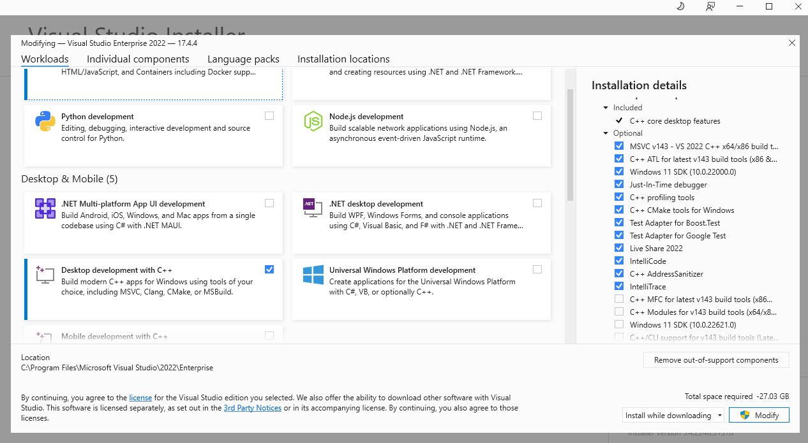
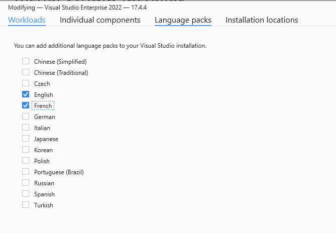
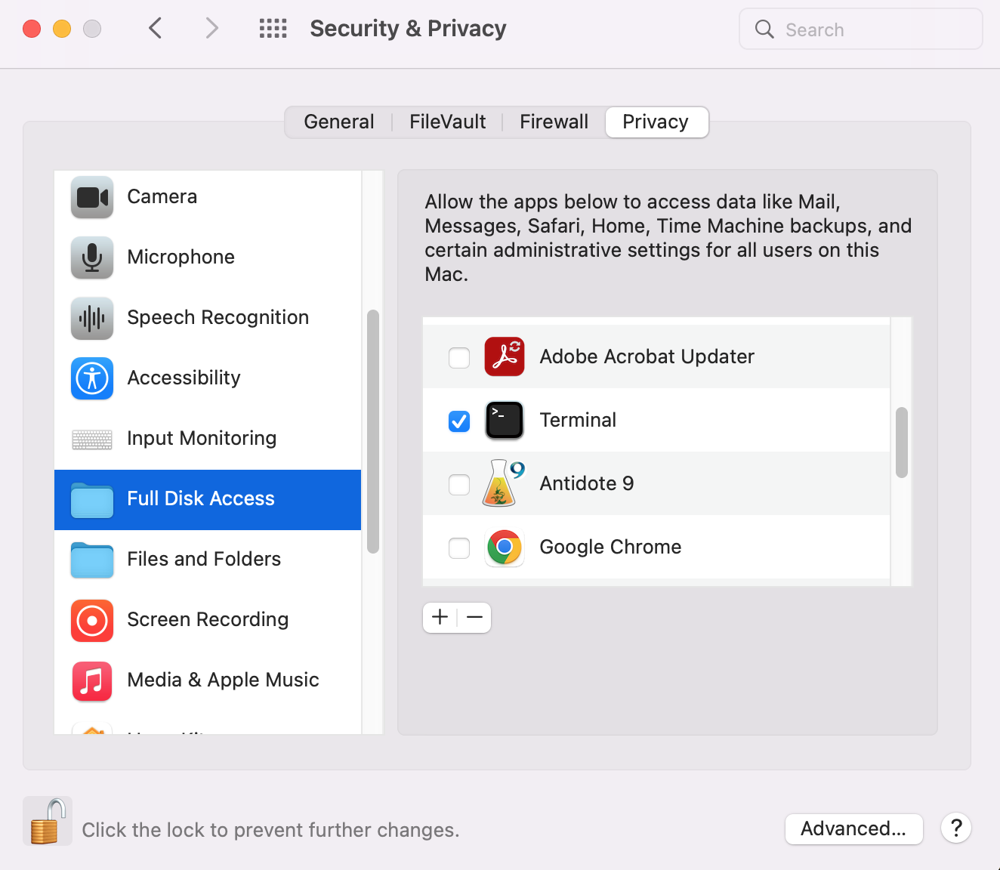
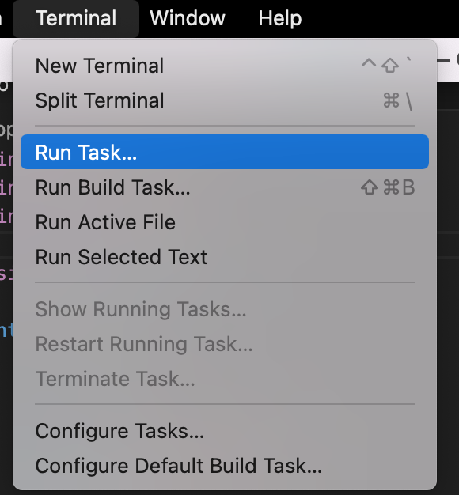
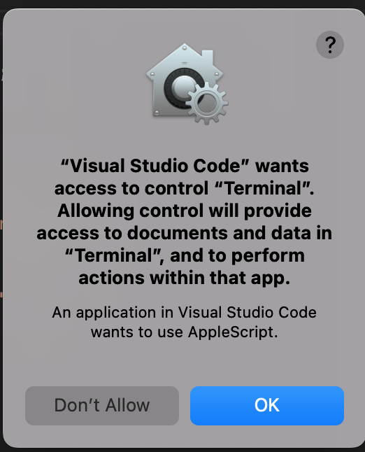

# Configuration d'environnements pour le développement C++

Visual Studio sur Windows est le seul environnement qui sera supporté en INF1015 et INF1005c. Ceci dit, ce document liste les options disponibles pour débuter avec le C++ sur les différentes platformes. Les options qui n'utilisent pas Windows nécessitent une compréhension de base de CMake. Généralement, les TD sont préconfigurés pour être executés sur toutes les plateformes.

Noter que Visual Studio sur macOS ne supportait pas le C++ et est maintenant discontinué de toute façon.

## Options disponibles

- [Visual Studio sur Windows](#Visual-Studio-pour-Windows) 🪟⭐
- [CLion et CMake sur Windows, macOS ou Linux](#CLion-et-CMake-sur-Windows-macOS-ou-Linux) 🍎
- [CMake sur Windows, macOS ou Linux](#CMake-sur-Windows-macOS-ou-Linux) 🐧
- [VsCode sur Windows, macOS ou Linux](#VsCode-sur-Windows-macOS-ou-Linux)

## Visual Studio pour Windows

> [!Note]
> ⭐ Cette option est à **prévilégier** pour tous les utilsateurs Windows qui préfèrent avoir un environnement de développement complet (IDE). Le développement C++ sur Visual Studio n'est pas disponible sur Mac ni Linux.

L'option recommendée sur Windows est d'utiliser Visual Studio Enterprise 2022. C'est d'ailleurs Visual Studio qui est installé dans les laboratoires informatiques et qui sera disponible lors des examens.

1. [Accepter l'offre étudiante Azure sur le lien suivant](https://azure.microsoft.com/fr-ca/free/students). Cliquer sur `Commencez gratuitement` et remplir le formulaire avec votre courriel institutionnel.
2. Obtenir une license pour Visual Studio Enterprise 2022. [Ce lien liste les étapes à suivre](https://www.polymtl.ca/gigl/obtention-des-produits-microsoft).
3. [Suivre la procédure d'installation officielle](https://www.polymtl.ca/gigl/procedure-dinstallation-de-visual-studio-2019).\*

> [!CAUTION] > **PACKETS À SÉLECTIONNER - NE PAS SAUTER CETTE ÉTAPE**
>
> \* À l'étape de la sélection des `Charge de travail`, la seule option importante à sélectionner est `Développement Desktop en C++` (voir capture) Ceci permettra de minimiser la taille de l'application. Vous pouvez choisir d'autres options selon vos besoins. Il est possible de les rajouter dans un 2e temps en relançant l'installateur

> [!TIP]
> Il est aussi possible de modifier la langue de Visual Studio dans l'onglet `Modules linguistiques` > 

> [!WARNING]
> Je vous conseille de décocher l'installation de GitHub Copilot pour une meilleure expérience académique.

## CLion et CMake sur Windows, macOS ou Linux

> [!Note]
> 🍎 Cette option est à prévilégier pour tous les utilsateurs de MacOs et qui préfèrent avoir un environnement de développement complet (IDE). Cette option est également possible sur Windows et Linux selon les préférences.

Il est possible d'utiliser CLion de Jetbrains comme IDE. Cette plateforme est fournie par les mêmes développeurs de PyCharm. CLion s'occupe de la configuration de CMake pour nous. D'ailleurs, CLion offre un débogeur intéressant. Cette option nécessite de se familiariser tranquilement avec CMake.

1. Si ce n'est pas déjà fait, [se créer un compte Jetbrains](https://account.jetbrains.com/login)
2. [Demander une license étudiante](https://account.jetbrains.com/licenses). (Sinon, on obtient seulement un essai de 30 jours.)
3. Configurer CLion avec le tutoriel officiel
   - [macOs](https://www.jetbrains.com/help/clion/quick-tutorial-on-configuring-clion-on-macos.html)
   - [Windows](https://www.jetbrains.com/help/clion/quick-tutorial-on-configuring-clion-on-windows.html)

> [!Important]
> La configuration d'un projet CLion se fait avec CMake, mais CLion automatise la configuration, ce qui évite de devoir execéuter des lignes de commandes. Il faudra néanmoins utiliser le fichier CMakeLists.txt fourni avec chaque TD. Lire la section su CMake plus bas pour plus d'information.

## CMake sur Windows, macOS ou Linux

> [!Caution]
> 🐧 Cette option demande plus d'opérations manuelles et est résevée aux utilisateurs qui sont plus confortables avec l'exécution en ligne de commande, ou les utilsateurs linux. CMake est le système de build recommandé pour les utilisateurs qui ne préfèrent pas avoir une environnement de développement complet (IDE), (ex. Vim, VsCode, Notepad++, etc.)

Si vous ne voulez pas utiliser d'IDE, vous pouvez compiler le tout en ligne de commande et s'aider avec CMake (ou d'un Makefile). Un fichier `CMakeLists.txt` est généralement fourni avec les TD.

> [!Important]
> Il faut d'abord installer Cmake. La méthode diffère selon votre système d'exploitation.

Voici les étapes pour compiler et exécuter son projet avec CMake:
Dans le répertoire parent **où contient le fichier CMakeLists.txt**, exécuter dans un terminal les commandes suivantes.

**Configurer le projet initial:**

Il faut d'abord configurer le projet. Cette étape n'est à faire qu'une seule fois.

```bash
mkdir build
cmake -S . -B build -DCMAKE_BUILD_TYPE=Debug
cmake --build build
cd build
```

**Pour compiler et exécuter le projet:**

À chaque changement, il suffit de faire:

```bash
make
./${nom du projet}
```

> [!TIP]
> Vous pouvez créer votre propre Makefile et y ajouter ces commandes pour éviter toujours devoir les copier/coller!

## VsCode sur Windows, macOS ou Linux

> [!Caution]
> Cette méthode n'est pas recommandée et demande plus de configuration manuelle.

VsCode fournit des outils pour compiler votre code C++. [Ce lien explique comment faire pour les différentes plateformes](https://code.visualstudio.com/docs/languages/cpp).

Ce repo contient [une configuration](/.vscode/) pour **macOS** pour le 1er TD. Une configuration pour les prochains sera fournie en temps et lieu. Il faut placer le dossier `.vscode` dans le répertoire parent de votre TD. S'il y a déjà un dossier `.vscode`, **LE REMPLACER**.

#### macOS

Ensuite, pour macOS, il faudra activer l'option `Full Disk Access` pour le terminal pour utiliser VsCode dans
`System Preferences -> Security & Privacy -> Privacy` (voir capture).



De plus, pour déboger avec VsCode, il faut donner l'accès au Terminal de débogage. Ainsi, dans la barre d'option du dessus, faire `Terminal -> Run Task... -> Open Terminal` et accorder les permissions. Note: il se peut que vous devez faire apparaitre toutes les taches avec `Show All Tasks`.




> [!TIP]
> Ce repo contient un projet de départ pour tester votre configuration sur macOS.
